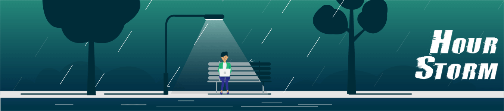

<!-- ====================== BANNER ====================== -->

  

<!-- ====================== NAME ====================== -->

<h1 align="center">Hi 👋 I'm Surya Pavan</h1>

<h3 align="center">A Passionate Software Developer from India</h3>

<!-- ====================== PROFILE PHOTO ====================== -->

  

📍 Vijayawada, India  
📧 suryapavanchinna2003@gmail.com

<!-- ====================== NAVIGATION LINKS ====================== -->

---

<!-- ====================== ABOUT ME ====================== -->

## 🙋 About Me

- 🔭 I’m currently working on **Flight Radar Project**
- 🌱 I’m currently learning **React, JavaScript, Node.js**
- 💬 Ask me about **Web Development**
- ⚡ Motto: **Always be the best version of yourself**

---

<!-- ====================== CONNECT BUTTONS ====================== -->

## 🤝 Connect With Me

---

<!-- ====================== PROFILE SUMMARY ====================== -->
## 🙋 Career Objective

A highly motivated individual with strong communication skills, eager to contribute to innovative and meaningful projects.  
Looking to join an organization that encourages continuous learning, collaboration, and professional growth.

I enjoy working with:

- Web Development
- Artificial Intelligence
- Problem Solving
- Open Source

---

<!-- ====================== SKILLS ====================== -->

## 🚀 Skills

---
## 🎓 Education

🎓 **B.Tech in Computer Science and Engineering**  
Koneru Lakshmaiah Education Foundation (2021 – 2025)  
GPA: 8.99  

📘 **Intermediate – MPC**  
Sri Chaitanya Junior College (2019 – 2021)  
GPA: 8.32  

🏫 **SSC**  
Sri Chaitanya School (2019)  
GPA: 9.8  

---

## 🚀 Technical Skills

### 💻 Programming Languages
- C
- Java
- Python
- HTML + CSS
- SQL
### 🛠 Tools & Technologies

### 🧠 Soft Skills
- Communication
- Decision Making
- Time Management
- Collaboration

---

## 💼 Projects

### 🌐 Online Social Media Platform (Java Full Stack)
- Built using Spring Boot with SQL integration
- Implemented RESTful APIs for efficient communication
- Optimized performance using caching and query handling
- Working on AWS deployment for scalability

### 📈 Stock Exchange Management System (Python Full Stack)
- Developed using Flask & Django with MongoDB
- Built RESTful APIs for backend functionality
- Deployed application on AWS
- Documented development on LinkedIn

### ✋ Hand Gesture Recognition (Deep Learning)
- Developed CNN model for gesture recognition
- Building web application for real-time interaction
- Collaborated with frontend and backend teams

---

## 💼 Internship

### 🤖 AI-ML Virtual Internship (2023)
- Gained practical experience in Artificial Intelligence and Machine Learning
- Worked on real-world AI/ML applications

---

## 📜 Certifications

- AWS Cloud Practitioner (CLF-C02)
- Red Hat Certified (EX-183)
- Google TensorFlow Developer Certified (2024)

---
<!-- ====================== GITHUB STATS ====================== -->

## 📊 GitHub Stats

  

---

<!-- ====================== VISITOR COUNTER ====================== -->

⭐ From Surya Pavan
